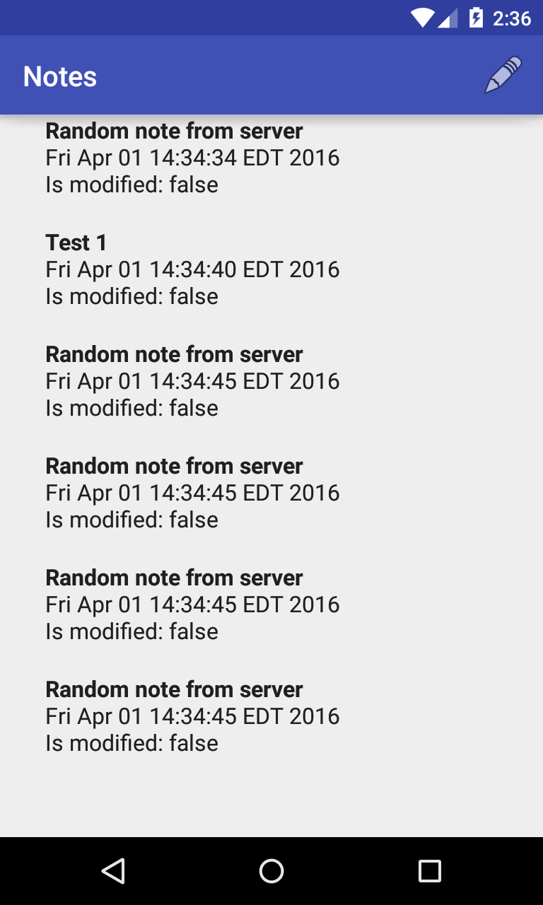
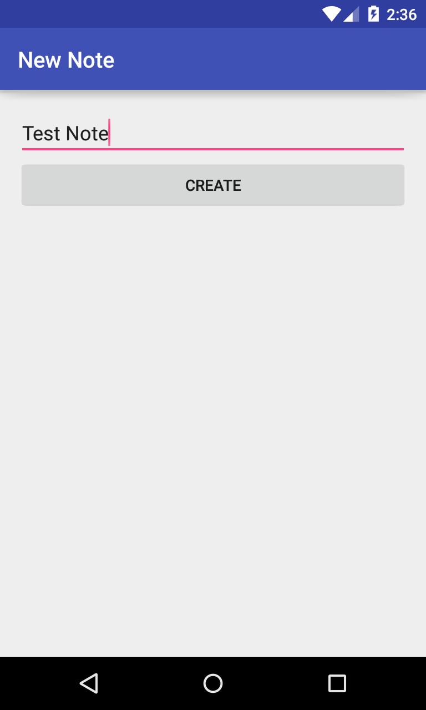

### Android Data Sync application sample

Simple todo application to demonstrate Android Data Sync based on following artciles:

- [Android Data Sync - Part 1](http://www.dmytrodanylyk.com/android-data-sync-part-1/)
- Android Data Sync - Part 2 (IN PROGRESS)

In current synchronization schema we need 4 layers:

- [Sync](https://github.com/dmytrodanylyk/android-data-sync-sample/tree/master/app/src/main/java/com/todo/sync) *(Only notes sync is implemented)*
- [Storage](https://github.com/dmytrodanylyk/android-data-sync-sample/tree/master/app/src/main/java/com/todo/db) *(Realm)*
- [Communication](https://github.com/dmytrodanylyk/android-data-sync-sample/tree/master/app/src/main/java/com/todo/sync/event) *(Green Robot Event Bus v3.0)*
- [User Interface](https://github.com/dmytrodanylyk/android-data-sync-sample/tree/master/app/src/main/java/com/todo/ui/notes)

Observe android log cat for more info.

[Video on YouTube](https://youtu.be/8u05NldhqGU)
